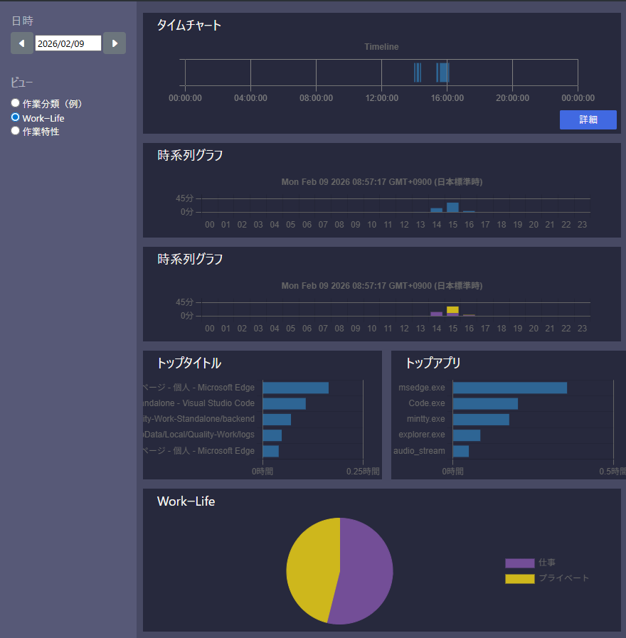
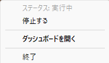

# Quality-Work (Standalone version)

## Overview
Quality-Work is an open-source time-tracking and work analytics tool designed specifically for desk workers. It automatically records your PC activities and uses AI to categorize and summarize them, allowing you to review your work history and productivity statistics effortlessly.

<p align="center">
  
  <br>
  <em>Dashboard interface (Currently in Japanese)</em>
</p>

### Why Quality-Work?

* "How much time did I actually spend on that project?"
* "What time of day am I most focused?"
* "How many hours am I truly working each day?"
By capturing and visualizing the daily tasks , Quality-Work provides the insights you need to optimize your workflow and improve efficiency.

### Key Features

* __Automatic Activity Logging:__ Automatically records window titles, keystrokes, scrolls, and mouse drags. No manual input is required from the user.
* __Meeting Detection:__ Automatically tracks time spent in remote meetings or voice calls by monitoring audio streams.
* __Privacy First:__ All recorded data is stored strictly on your local storage.
* __Web-Based Dashboard:__ View your window history and work logs through a clean browser interface.
* __Visual Analytics:__ Generate graphs to visualize daily working hours and activity trends.
* __AI-Powered Categorization:__
    * Automatically classify tasks using two methods: Keyword Matching or AI-based Classification.
    * Full flexibility: You define the categories and the criteria for how your work is organized.
* __Detailed Reporting:__ View categorized work data in intuitive charts to better understand your output.

## Support platform

* Windows (x64)
* MacOS (Apple Silicon)

## License

Copyright (c) 2025 Kazuhiro Kuyama, System Design K2

Licensed under the MIT License

## Build & Development

### Build from Source

To build Quality-Work locally for development or manual installation, follow these steps.

#### Prerequisites

Ensure you have the following tools installed:

* **Python**: **v3.11 or 3.12** (Ensure this matches the requirement in `pyproject.toml`)
* **Poetry**: **v1.7.1 or later**
* **Node.js**: **v20.11.0 or later**
* **GNU Make**: Required to run the build automation scripts

#### 1. Setup Development Environment

First, initialize the environment and install all necessary dependencies:

```bash
% make env
```

#### 2. Build the Module

To compile the application and generate the distribution files:

```bash
% make module
```

Upon a successful build, the output files will be located in the `` backend/dist `` directory.


## How to Use

<mark> IMPORTANT </mark> : The application interface (GUI and Dashboard) is currently available in Japanese only.


### Starting the Application

Simply double-click the executable to launch Quality-Work. The application runs in the background, and its icon will appear in the System Tray (Taskbar notification area).

### System Tray Menu

<p align="center">
  
  <br>
  <em>System Tray Menu (Currently in Japanese)</em>
</p>

Right-click the tray icon to access the following options:

* __Start / Stop Recording:__ Toggle the data collection process.

    * Recording starts automatically upon launch.

    * While stopped, the background data collection is paused, but you can still access and view previously recorded data.

* __Open Dashboard:__ Launch your default web browser to view the analytics dashboard.

* __Exit:__ Completely shut down the application.


